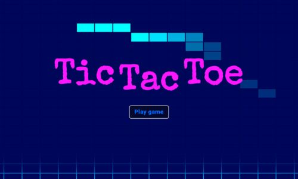
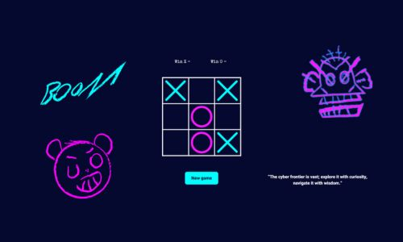

# Игра крестики нолики.

Технологии которые использовались **html**, **css**, **javascript**.

;

* Реализована анимация появления крестика и нолика.
* Реализовано победа или ничья что также отображается.
* Проделана анимация и работа с svg элементами.
* При входе сделана прикольная анимация главного экрана.
* При появлении крестика и нолика проигрывается звуки.
* Также во время игры случайным обозом появляются цитаты.
* Для рисования svg элементов использовалась программа Adobe Illustrator.

;